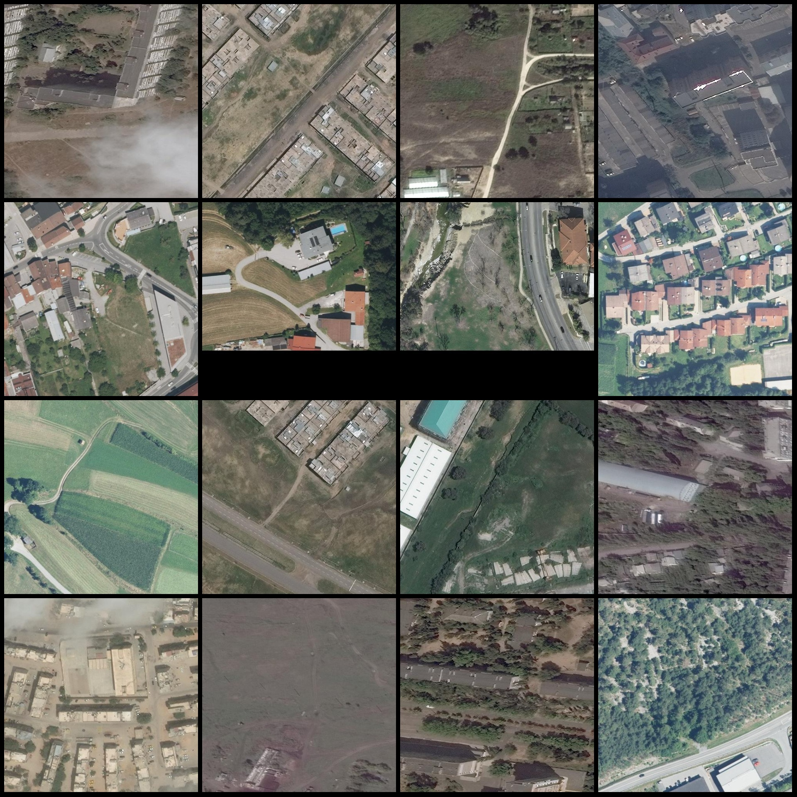
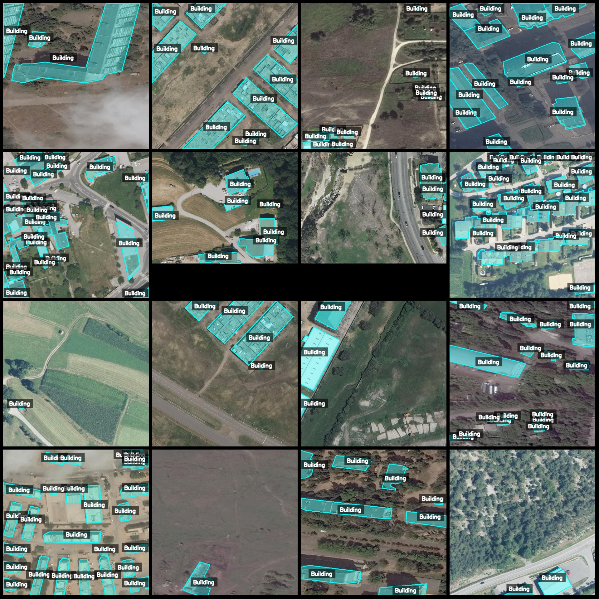
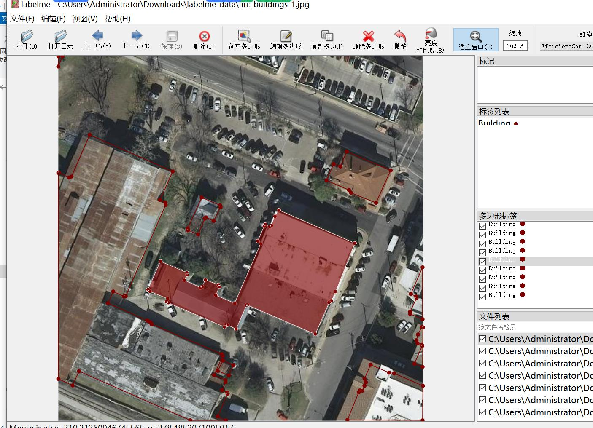

# Drone Observation of Rural Homestead Land Division Detection Data Set in LabelMe Format with 8510 Images and 1 Category

Dataset Format: LabelMe format (excluding mask files, only containing jpg images and corresponding json files)
Number of Images (JPG file count): 8510
Number of Annotations (JSON file count): 8510
Number of Annotation Categories: 1
Annotation Category Name: ["Building"]
Number of Boxes for Each Category:
Building count = 127527
Total Boxes: 127527
Annotation Tool Used: labelme=5.5.0
Repository: firc-dataset
Image Resolution: Multiple resolutions, such as 500x500, 512x512, etc.
Drone: DJI M350rtk
Collected Height: 300m
Collected Angle: 90°
Annotation Rules: Polygon box is drawn around the category
Important Note: The dataset can be opened and edited using labelme, but the json data set needs to be converted into a mask or YOLO/COCO format for semantic segmentation or instance segmentation.
Special Remark: This dataset does not guarantee the accuracy of the trained model or weight files.
Image Preview:
Annotation Example:
Original Image:
Annotation Drawing Results:
LabelMe Editing Example:

Image

Here is a pay link on Stripe ( https://buy.stripe.com/3cs8yP7sY87d0vu9AB ). Please contact me lonlonago@foxmail.com after funding $89, and I will send you a complete data files , thank you!

